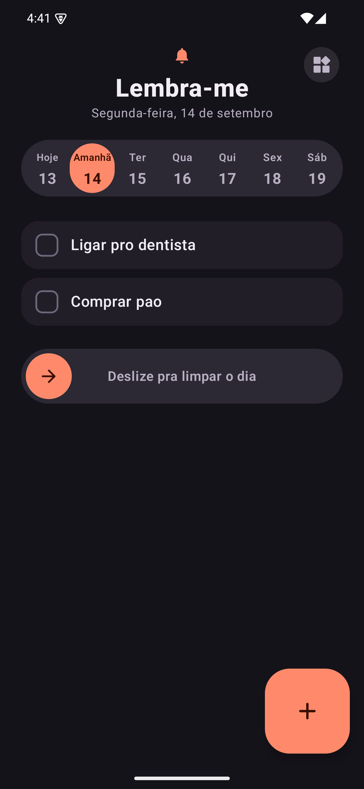
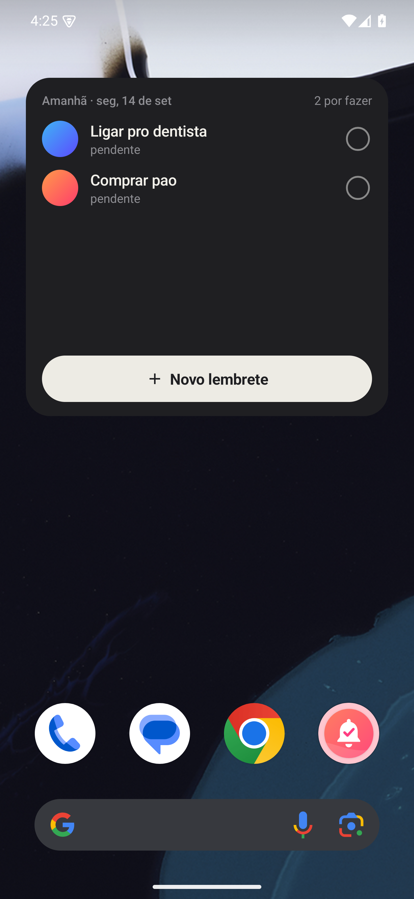

# Lembra-me

Widget de tarefas do **próximo dia** para Android. Nada de semana inteira,
nada de projeto: só o que você não pode esquecer amanhã (ou nos próximos dias).

- 7 dias no máximo (hoje + 6). Tarefa com mais de uma semana some sozinha.
- Dois widgets (Hoje e Amanhã) com checkbox que funciona ali mesmo e botão de novo lembrete.
- Animações inspiradas nos blocos do [bencho.dev](https://bencho.dev):
  checklist com uma mola por linha, seletor com indicador em duas fases,
  sino com oscilação amortecida e slide-to-confirm pra limpar o dia.

## Instalar no celular

1. Pegue o `app-release.apk` (em `release/` ou no artifact do GitHub Actions).
2. Mande pro celular (Quick Share, cabo, Drive…) e toque nele.
3. Aceite "instalar de fontes desconhecidas" se pedir.
4. Segure na tela inicial → **Widgets** → **Lembra-me** → arraste.

## Build

```
./gradlew assembleRelease
```
Requer JDK 17 e Android SDK (API 35).

## Screenshots

| App | Widget |
|---|---|
|  |  |

## Estrutura

- `app/src/main/java/dev/mag/lembrame/data` — modelo `Task` e `TaskRepository` (DataStore + JSON, limpeza automática de 7 dias)
- `app/src/main/java/dev/mag/lembrame/ui` — tela principal, tema e componentes animados
- `app/src/main/java/dev/mag/lembrame/widget` — widget Glance "Amanhã"
- `release/` — APK pronto pra instalar e screenshots
- `.github/workflows/build.yml` — gera o APK no GitHub Actions a cada push em `main`
